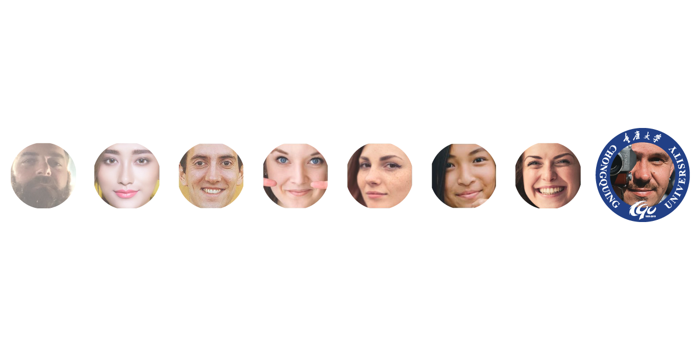

# Adding a frame to your wechat profile

## motivation

While we can easily create a script and run a batch task using photoshop, when the requirement specifies that 
there is a need to find the person's face on the profile and to only focus on the face section,
I found it interesting creating a script that does just that.
 

## Requirements
python 3
cv2
dlib
imutils

## Here are the main references:

*[face detection](https://towardsdatascience.com/a-guide-to-face-detection-in-python-3eab0f6b9fc1) 
*[blur detection](https://www.pyimagesearch.com/2015/09/07/blur-detection-with-opencv/)

